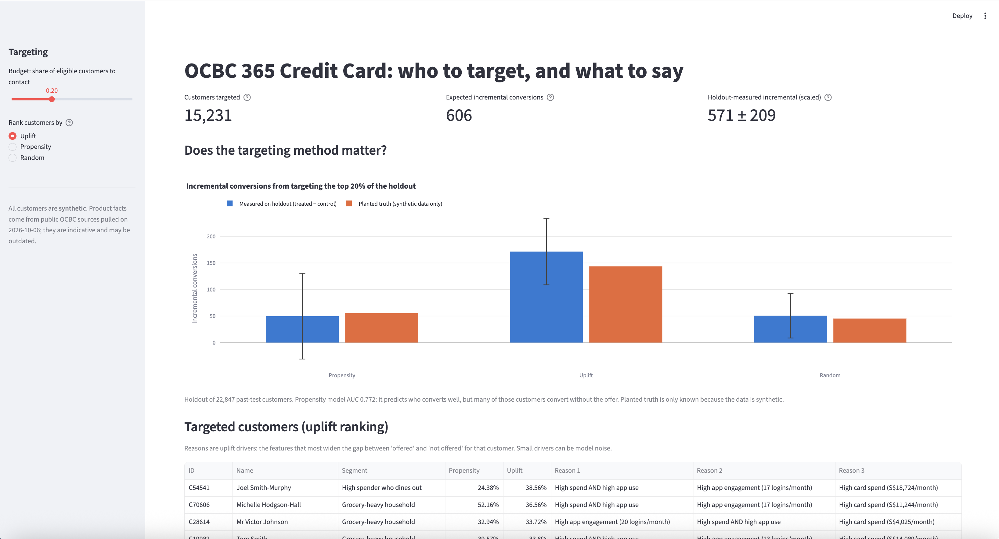
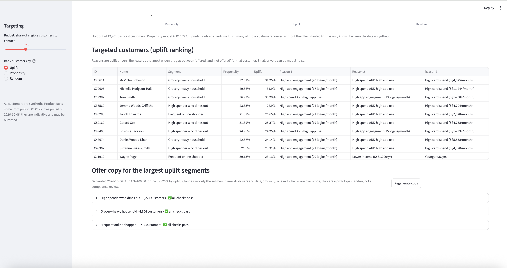
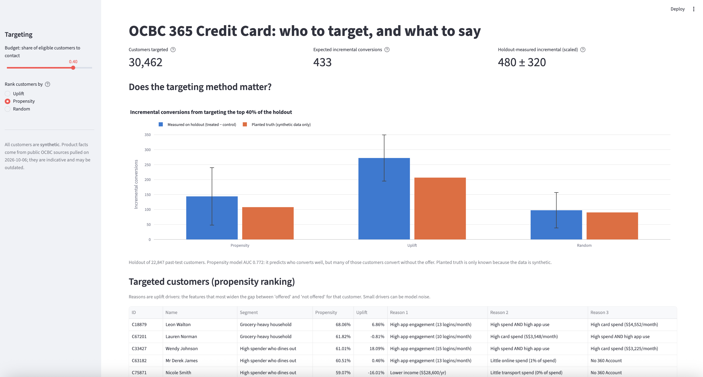
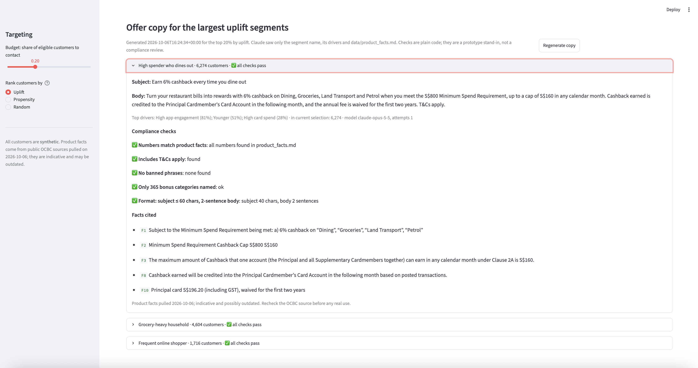

# OCBC 365 Card campaign targeting (prototype)

A marketing prototype for a cashback credit card launch. It decides **who to target** by ranking customers
on **uplift** (the extra chance of converting that the offer itself causes) rather than propensity (the chance of
converting at all). Then it shows **what to say**: Claude writes offer copy for each segment, grounded in cited
product facts, and plain-code compliance checks run on every draft. Every score shows why.

> **Unofficial prototype.** Not affiliated with or endorsed by OCBC. **All customer data is synthetic.** Product
> facts for the OCBC 365 Credit Card come from OCBC's public product page and T&Cs (terms effective 1 Nov 2026),
> pulled 6 Oct 2026. They are indicative and may be outdated: recheck the source before relying on any figure.



<details>
<summary>More screenshots: targeted customers, propensity ranking, offer copy and checks</summary>

**Targeted customers with their reasons**, and the offer-copy sections:



**Propensity ranking at a 40% budget.** High propensity, but often little or negative uplift:



**Offer copy for one segment**, with each compliance check and the cited facts:



</details>

## How it works
1. **Product facts:** `scripts/build_product_facts.py` downloads the 365 product page and T&C PDF into
   `data/ocbc_cards/` and writes [`data/product_facts.md`](data/product_facts.md): 15 facts, each checked word for
   word against its source.
2. **Synthetic customers:** `src/data_gen.py` makes 100,000 customers, each with a `marketing_opt_in` flag, and a
   past 50/50 randomised offer among eligible, opted-in customers. The answer is planted: baseline conversion averages
   about 3%, and the offer adds +6 points only for high spenders with high app engagement.
3. **Models:** `src/core.py` fits logistic regressions: a propensity model, and a two-model uplift estimate
   (uplift = P(convert | offered) − P(convert | not offered)). Each customer gets their top uplift drivers in plain
   English, e.g. "High app engagement (15 logins/month)", plus a spend-mix segment.
4. **Evaluation:** `src/eval.py` compares propensity, uplift and random targeting on a 30% holdout.
5. **Offer copy:** `src/offer_copywriter.py` asks Claude for a subject and 2-sentence body for the 3 largest targeted
   segments, using only the segment's drivers and the facts table. Every call has a timeout and a try/except. If Claude
   fails or is slow, that segment falls back to its template and the app shows a friendly notice. `check_copy()` then applies five rules in plain code:
   - numbers must appear in the facts;
   - "T&Cs apply" must be present;
   - no banned phrases;
   - only 365 bonus categories may be named next to a rate;
   - subject and body length.

## Results
Top 20% of a 19,401-customer holdout (703 conversions), from [`data/eval/SUMMARY.md`](data/eval/SUMMARY.md):

| Strategy | Offered vs not-offered conversion | Measured incremental conversions | Planted truth |
|---|---|---|---|
| **Uplift** | 8.8% vs 3.9% | **191 ± 60** | 120 |
| Propensity | 11.3% vs 9.9% | 51 ± 75 | 47 |
| Random | 4.2% vs 3.1% | 45 ± 41 | 38 |

Propensity scores well (AUC 0.779), but it targets customers who convert anyway, mostly existing cardholders. So it
does no better than random. All three generated copy drafts passed every check on the first attempt.

**These numbers are optimistic.** We planted the response pattern ourselves, then chose the `spend_x_app` feature and
the regularisation knowing it. Real campaign data will be noisier.

## Run it
Python 3.11 and an [Anthropic API key](https://console.anthropic.com/).

```bash
python3.11 -m venv .venv && source .venv/bin/activate
pip install -r requirements.txt
echo 'ANTHROPIC_API_KEY=your-key-here' > .env   # gitignored; never commit it

python src/data_gen.py           # synthetic customers -> data/synthetic/ (~6 s)
python src/core.py               # fit models, print coefficients and sample drivers
python src/eval.py               # holdout comparison -> data/eval/SUMMARY.md, data/generated/eval.html
python src/offer_copywriter.py   # copy + checks for 3 segments: 3-6 Claude calls, ~1 min
streamlit run app.py
pytest tests/ -v                 # 3 guardrail tests (~70 s, no API calls)
```

Without a key, everything except copy generation runs. The app shows the last saved copy, or each segment's
fallback template, with a notice instead of a stack trace. The model defaults to `claude-opus-5-5`; set `OCBC_CAMPAIGN_MODEL` to change it.

## Files
| File | What it does |
|---|---|
| `app.py` | Streamlit UI: budget and ranking controls, metric tiles, comparison chart, targeted customers with reasons, copy and checks per segment. |
| `src/data_gen.py` | Synthetic customers and the simulated randomised campaign. |
| `src/core.py` | Features, propensity and two-model uplift, per-customer drivers, segments. |
| `src/eval.py` | 70/30 stratified holdout, incremental conversions by strategy, plotly chart, summary. |
| `src/offer_copywriter.py` | Claude copy generation and the plain-code `check_copy()`. |
| `scripts/build_product_facts.py` | Downloads OCBC 365 sources and writes the verified facts table. |
| `scripts/clean_products.py` | Cleans OCBC's public product API JSON (deposit, loan and investment products). |
| `tests/test_guardrails.py` | No opted-out customer in any target list; uplift beats random at 20%; `check_copy()` rejects "guaranteed". |

See [`HANDOFF.md`](HANDOFF.md) for assumptions, known shortcuts and what productionising would take, and
[`docs/SESSION_LOG.md`](docs/SESSION_LOG.md) for how it was built.
